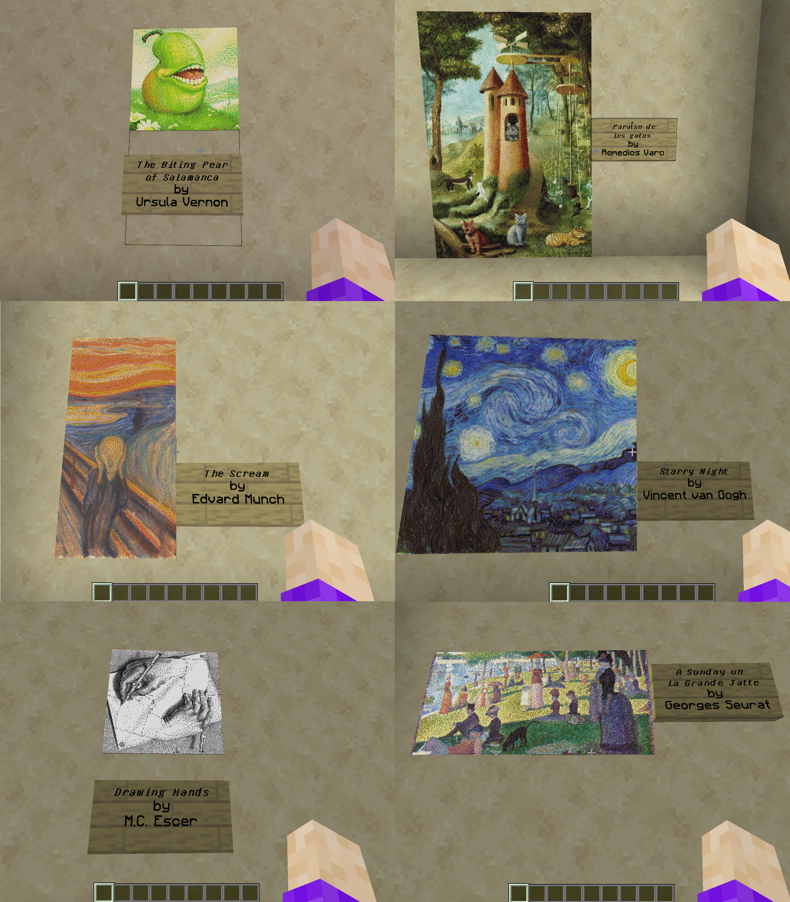

# Genuary2025

genuary 2025 stuff

some of these will liekly become new bots in the future.

### day 1

Vertical or horizontal lines only.

started on a base of [@tenprint](https://github.com/alien-sunset/tracery-bots/tree/main/TenPrint) 's Tracery.

I was actually aiming for a maze pattern, but hit on something that reminded me more of weaving, and then wandered my way to this.

kinda want to steal an idea from [@HitomezashiBot](https://github.com/alien-sunset/tracery-bots/tree/main/hitomezashi) and see if i can do some remembering and mirroring of elements to get something that looks like actual twill weaving patterns, but it's late and that will have to wait for another day.

### day 2 ( & 3 )

Layers upon layers upon layers.

inspired by some of the works of [Vera Molnár](https://en.wikipedia.org/wiki/Vera_Moln%C3%A1r), this idea had actually been percolating in the back of my mind for a while, but i just kept getting distracted.

also sorta counts as day 3, as the Tracery (with spaces) is exactly 42 lines. which is nice as I have an appointment tomorrow and won't be able to do much else.

### day 4

Black on black.

I dunno, it kiiiinda fits, these are all "hues" of black, yeeeah. i was going fo a kinda "dark laser show" kinda look, and I think i get that pretty well.
Either way it looks kinda cool, and I’m pretty happy with the outcome, even if it can be extra hard to tell whats going on on especially dark/high contrast screens.

### day 5 & 6

Isometric Art & Make a landscape using only primitive shapes

![a collage of four images, each is a square with a blue gradient going from top to bottom, superimposed on top of this is a flat isometric plane made of cubes of various shades of greens -"grass", sometimes this plane has a small patch of squares made of various shades of blue, with pale beige squares bordering the green on the righthand front edge - "water and sand", or a hill will various shades of brown on its sides in the back corner, or a small tree on it's lefthand corner, or two, all three, each built out of small cubes.](day5-6.jpg)

![a square with a blue gradient going from top to bottom, superimposed on top of this is a flat isometric plane made of cubes of various shades of greens -"grass", there is a small patch of squares made of various shades of blue, with pale beige squares bordering the green on the righthand front edge - "water and sand", a hill will various shades of brown on its sides in the back corner, and a small tree on it's lefthand corner, each built out of small cubes. there is a small Minecraft sheep in the grassy area.](day5-6_bonus.jpg)

ok, I admit it, I like playing Minecraft. I wasn't sure what I was going to do for day five OR six, and certainly wasn't planning on combining them in the beginning, but then the idea just struck me one evening while my family was playing together.

was pretty fun overall, and I got to really work my spacial thinking muscles to make the cubes and put everything together properly.

### day 7

Use software that is not intended to create art or images.

I originally wasn't going to submit anything for this day as i had a self imposed challenge of doing everything via tracery and/or svg. but i was reminded of all the map art i had made in my family's season 4 Minecraft server. when Minecraft is ostensibly a survival/building/farming sim/sandbox game and not really made for generating visual art.

### day 8

Draw one million of something.

this one kinda killed my poor computer... a million is A LOT! this is all tracery/JavaScript rendering into SVG it took several seconds to finish processing the tracery and then over two minutes to finish drawing all the stars. I’m sure i could have chosen something smaller/simpler to draw for this one, but what would the fun have been in that?
